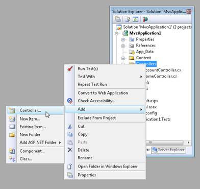
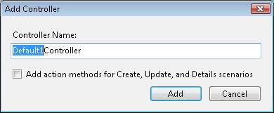
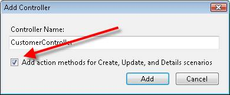
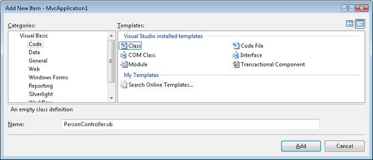

# Creating a Controller (VB)

by [Stephen Walther](https://github.com/StephenWalther)

> In this tutorial, Stephen Walther demonstrates how you can add a controller to an ASP.NET MVC application.

The goal of this tutorial is to explain how you can create new ASP.NET MVC controllers. You learn how to create controllers both by using the Visual Studio Add Controller menu option and by creating a class file by hand.

### Using the Add Controller Menu Option

The easiest way to create a new controller is to right-click the Controllers folder in the Visual Studio Solution Explorer window and select the **Add, Controller** menu option (see Figure 1). Selecting this menu option opens the **Add Controller** dialog (see Figure 2).

**Figure 01**: Adding a new controller([Click to view full-size image](creating-a-controller-vb/_static/image2.png))

**Figure 02**: The Add Controller dialog ([Click to view full-size image](creating-a-controller-vb/_static/image4.png))

Notice that the first part of the controller name is highlighted in the **Add Controller** dialog. Every controller name must end with the suffix *Controller*. For example, you can create a controller named *ProductController* but not a controller named *Product*.

If you create a controller that is missing the *Controller* suffix then you won't be able to invoke the controller. Don't do this -- I've wasted countless hours of my life after making this mistake.

**Listing 1 - Controllers\ProductController.vb**

[!code-vb[Main](creating-a-controller-vb/samples/sample1.vb)]

You should always create controllers in the Controllers folder. Otherwise, you'll be violating the conventions of ASP.NET MVC and other developers will have a more difficult time understanding your application.

### Scaffolding Action Methods

When you create a controller, you have the option to generate Create, Update, and Details action methods automatically (see Figure 3). If you select this option then the controller class in Listing 2 is generated.

**Figure 03**: Creating action methods automatically ([Click to view full-size image](creating-a-controller-vb/_static/image6.png))

**Listing 2 - Controllers\CustomerController.vb**

[!code-vb[Main](creating-a-controller-vb/samples/sample2.vb)]

These generated methods are stub methods. You must add the actual logic for creating, updating, and showing details for a customer yourself. But, the stub methods provide you with a nice starting point.

### Creating a Controller Class

The ASP.NET MVC controller is just a class. If you prefer, you can ignore the convenient Visual Studio controller scaffolding and create a controller class by hand. Follow these steps:

1. Right-click the Controllers folder and select the menu option **Add, New Item** and select the **Class** template (see Figure 4).
2. Name the new class PersonController.vb and click the **Add** button.
3. Modify the resulting class file so that the class inherits from the base System.Web.Mvc.Controller class (see Listing 3).

**Figure 04**: Creating a new class([Click to view full-size image](creating-a-controller-vb/_static/image8.png))

**Listing 3 - Controllers\PersonController.vb**

[!code-vb[Main](creating-a-controller-vb/samples/sample3.vb)]

The controller in Listing 3 exposes one action named Index() that returns the string "Hello World!". You can invoke this controller action by running your application and requesting a URL like the following:

`http://localhost:40071/Person`

> [!NOTE]
> 
> The ASP.NET Development Server uses a random port number (for example, 40071). When entering a URL to invoke a controller, you'll need to supply the right port number. You can determine the port number by hovering your mouse over the icon for the ASP.NET Development Server in the Windows Notification Area (bottom-right of your screen).
> 
> [!div class="step-by-step"]
> [Previous](adding-dynamic-content-to-a-cached-page-vb.md)
> [Next](creating-an-action-vb.md)
