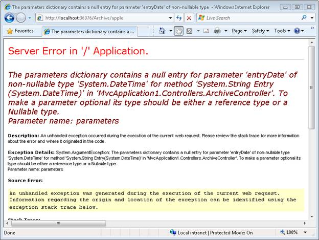

# Creating Custom Routes (VB)

by [Microsoft](https://github.com/microsoft)

> Learn how to add custom routes to an ASP.NET MVC application. In this tutorial, you learn how to modify the default route table in the Global.asax file.

In this tutorial, you learn how to add a custom route to an ASP.NET MVC application. You learn how to modify the default route table in the Global.asax file with a custom route.

In ASP.NET MVC applications, the default route table will work just fine. However, you might discover that you have specialized routing needs. In that case, you can create a custom route.

Imagine, for example, that you are building a blog application. You might want to handle incoming requests that look like this:

/Archive/12-25-2009

When a user enters this request, you want to return the blog entry that corresponds to the date 12/25/2009. In order to handle this type of request, you need to create a custom route.

The Global.asax file in Listing 1 contains a new custom route, named Blog, which handles requests that look like /Archive/*entry date*.

**Listing 1 - Global.asax (with custom route)**

[!code-vb[Main](creating-custom-routes-vb/samples/sample1.vb)]

The order of the routes that you add to the route table is important. Our new custom Blog route is added before the existing Default route. If you reversed the order, then the Default route always will get called instead of the custom route.

The custom Blog route matches any request that starts with /Archive/. So, it matches all of the following URLs:

- /Archive/12-25-2009

- /Archive/10-6-2004

- /Archive/apple

The custom route maps the incoming request to a controller named Archive and invokes the Entry() action. When the Entry() method is called, the entry date is passed as a parameter named entryDate.

You can use the Blog custom route with the controller in Listing 2.

**Listing 2 - ArchiveController.vb**

[!code-vb[Main](creating-custom-routes-vb/samples/sample2.vb)]

Notice that the Entry() method in Listing 2 accepts a parameter of type DateTime. The MVC framework is smart enough to convert the entry date from the URL into a DateTime value automatically. If the entry date parameter from the URL cannot be converted to a DateTime, an error is raised (see Figure 1).

**Figure 1 - Error from converting parameter**

**Figure 01**: Error from converting parameter ([Click to view full-size image](creating-custom-routes-vb/_static/image2.png))

## Summary

The goal of this tutorial was to demonstrate how you can create a custom route. You learned how to add a custom route to the route table in the Global.asax file that represents blog entries. We discussed how to map requests for blog entries to a controller named ArchiveController and a controller action named Entry().

> [!div class="step-by-step"]
> [Previous](asp-net-mvc-controller-overview-vb.md)
> [Next](creating-a-route-constraint-vb.md)
