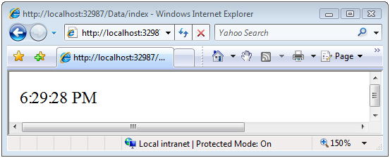
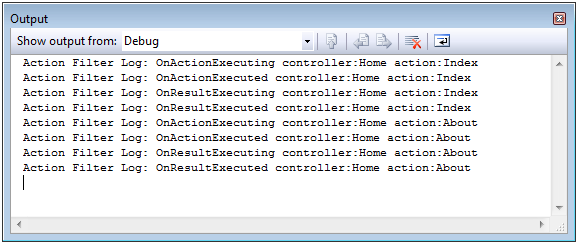

# Understanding Action Filters (VB)

by [Microsoft](https://github.com/microsoft)

[Download PDF](https://download.microsoft.com/download/e/f/3/ef3f2ff6-7424-48f7-bdaa-180ef64c3490/ASPNET_MVC_Tutorial_14_VB.pdf)

> The goal of this tutorial is to explain action filters. An action filter is an attribute that you can apply to a controller action -- or an entire controller -- that modifies the way in which the action is executed.

## Understanding Action Filters

The goal of this tutorial is to explain action filters. An action filter is an attribute that you can apply to a controller action -- or an entire controller -- that modifies the way in which the action is executed. The ASP.NET MVC framework includes several action filters:

- OutputCache – This action filter caches the output of a controller action for a specified amount of time.
- HandleError – This action filter handles errors raised when a controller action executes.
- Authorize – This action filter enables you to restrict access to a particular user or role.

You also can create your own custom action filters. For example, you might want to create a custom action filter in order to implement a custom authentication system. Or, you might want to create an action filter that modifies the view data returned by a controller action.

In this tutorial, you learn how to build an action filter from the ground up. We create a Log action filter that logs different stages of the processing of an action to the Visual Studio Output window.

### Using an Action Filter

An action filter is an attribute. You can apply most action filters to either an individual controller action or an entire controller.

For example, the Data controller in Listing 1 exposes an action named `Index()` that returns the current time. This action is decorated with the `OutputCache` action filter. This filter causes the value returned by the action to be cached for 10 seconds.

**Listing 1 – `Controllers\DataController.vb`**

[!code-vb[Main](understanding-action-filters-vb/samples/sample1.vb)]

If you repeatedly invoke the `Index()` action by entering the URL /Data/Index into the address bar of your browser and hitting the Refresh button multiple times, then you will see the same time for 10 seconds. The output of the `Index()` action is cached for 10 seconds (see Figure 1).

**Figure 01**: Cached time ([Click to view full-size image](understanding-action-filters-vb/_static/image3.png))

In Listing 1, a single action filter – the `OutputCache` action filter – is applied to the `Index()` method. If you need, you can apply multiple action filters to the same action. For example, you might want to apply both the `OutputCache` and `HandleError` action filters to the same action.

In Listing 1, the `OutputCache` action filter is applied to the `Index()` action. You also could apply this attribute to the `DataController` class itself. In that case, the result returned by any action exposed by the controller would be cached for 10 seconds.

### The Different Types of Filters

The ASP.NET MVC framework supports four different types of filters:

1. Authorization filters – Implements the `IAuthorizationFilter` attribute.
2. Action filters – Implements the `IActionFilter` attribute.
3. Result filters – Implements the `IResultFilter` attribute.
4. Exception filters – Implements the `IExceptionFilter` attribute.

Filters are executed in the order listed above. For example, authorization filters are always executed before action filters and exception filters are always executed after every other type of filter.

Authorization filters are used to implement authentication and authorization for controller actions. For example, the Authorize filter is an example of an Authorization filter.

Action filters contain logic that is executed before and after a controller action executes. You can use an action filter, for instance, to modify the view data that a controller action returns.

Result filters contain logic that is executed before and after a view result is executed. For example, you might want to modify a view result right before the view is rendered to the browser.

Exception filters are the last type of filter to run. You can use an exception filter to handle errors raised by either your controller actions or controller action results. You also can use exception filters to log errors.

Each different type of filter is executed in a particular order. If you want to control the order in which filters of the same type are executed then you can set a filter's Order property.

The base class for all action filters is the `System.Web.Mvc.FilterAttribute` class. If you want to implement a particular type of filter, then you need to create a class that inherits from the base Filter class and implements one or more of the IAuthorizationFilter, IActionFilter, IResultFilter, or ExceptionFilter interfaces.

### The Base ActionFilterAttribute Class

In order to make it easier for you to implement a custom action filter, the ASP.NET MVC framework includes a base `ActionFilterAttribute` class. This class implements both the `IActionFilter` and `IResultFilter` interfaces and inherits from the `Filter` class.

The terminology here is not entirely consistent. Technically, a class that inherits from the ActionFilterAttribute class is both an action filter and a result filter. However, in the loose sense, the word action filter is used to refer to any type of filter in the ASP.NET MVC framework.

The base ActionFilterAttribute class has the following methods that you can override:

- OnActionExecuting – This method is called before a controller action is executed.
- OnActionExecuted – This method is called after a controller action is executed.
- OnResultExecuting – This method is called before a controller action result is executed.
- OnResultExecuted – This method is called after a controller action result is executed.

In the next section, we'll see how you can implement each of these different methods.

### Creating a Log Action Filter

In order to illustrate how you can build a custom action filter, we'll create a custom action filter that logs the stages of processing a controller action to the Visual Studio Output window. Our `LogActionFilter` is contained in Listing 2.

**Listing 2 – `ActionFilters\LogActionFilter.vb`**

[!code-vb[Main](understanding-action-filters-vb/samples/sample2.vb)]

In Listing 2, the `OnActionExecuting()`, `OnActionExecuted()`, `OnResultExecuting()`, and `OnResultExecuted()` methods all call the `Log()` method. The name of the method and the current route data is passed to the `Log()` method. The `Log()` method writes a message to the Visual Studio Output window (see Figure 2).

**Figure 02**: Writing to the Visual Studio Output window ([Click to view full-size image](understanding-action-filters-vb/_static/image6.png))

The Home controller in Listing 3 illustrates how you can apply the Log action filter to an entire controller class. Whenever any of the actions exposed by the Home controller are invoked – either the `Index()` method or the `About()` method – the stages of processing the action are logged to the Visual Studio Output window.

**Listing 3 – `Controllers\HomeController.vb`**

[!code-vb[Main](understanding-action-filters-vb/samples/sample3.vb)]

### Summary

In this tutorial, you were introduced to ASP.NET MVC action filters. You learned about the four different types of filters: authorization filters, action filters, result filters, and exception filters. You also learned about the base `ActionFilterAttribute` class.

Finally, you learned how to implement a simple action filter. We created a Log action filter that logs the stages of processing a controller action to the Visual Studio Output window.

> [!div class="step-by-step"]
> [Previous](asp-net-mvc-routing-overview-vb.md)
> [Next](improving-performance-with-output-caching-vb.md)
