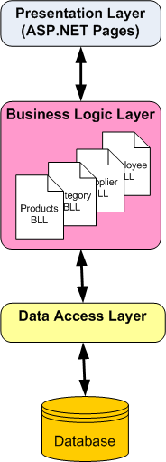
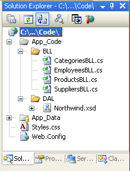
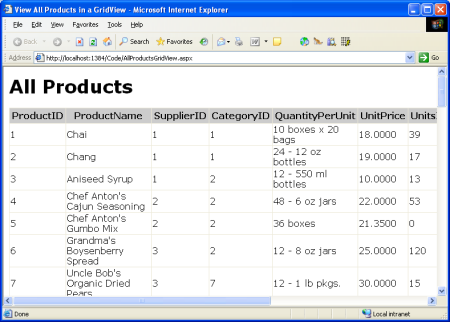
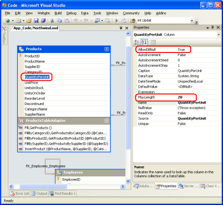
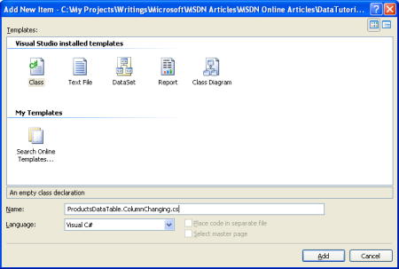

# Creating a Business Logic Layer (C#)

by [Scott Mitchell](https://twitter.com/ScottOnWriting)

[Download PDF](creating-a-business-logic-layer-cs/_static/datatutorial02cs1.pdf)

> In this tutorial we'll see how to centralize your business rules into a Business Logic Layer (BLL) that serves as an intermediary for data exchange between the presentation layer and the DAL.

## Introduction

The Data Access Layer (DAL) created in the [first tutorial](creating-a-data-access-layer-cs.md) cleanly separates the data access logic from the presentation logic. However, while the DAL cleanly separates the data access details from the presentation layer, it does not enforce any business rules that may apply. For example, for our application we may want to disallow the `CategoryID` or `SupplierID` fields of the `Products` table to be modified when the `Discontinued` field is set to 1, or we might want to enforce seniority rules, prohibiting situations in which an employee is managed by someone who was hired after them. Another common scenario is authorization perhaps only users in a particular role can delete products or can change the `UnitPrice` value.

In this tutorial we'll see how to centralize these business rules into a Business Logic Layer (BLL) that serves as an intermediary for data exchange between the presentation layer and the DAL. In a real-world application, the BLL should be implemented as a separate Class Library project; however, for these tutorials we'll implement the BLL as a series of classes in our `App_Code` folder in order to simplify the project structure. Figure 1 illustrates the architectural relationships among the presentation layer, BLL, and DAL.

**Figure 1**: The BLL Separates the Presentation Layer from the Data Access Layer and Imposes Business Rules

## Step 1: Creating the BLL Classes

Our BLL will be composed of four classes, one for each TableAdapter in the DAL; each of these BLL classes will have methods for retrieving, inserting, updating, and deleting from the respective TableAdapter in the DAL, applying the appropriate business rules.

To more cleanly separate the DAL- and BLL-related classes, let's create two subfolders in the `App_Code` folder, `DAL` and `BLL`. Simply right-click on the `App_Code` folder in the Solution Explorer and choose New Folder. After creating these two folders, move the Typed DataSet created in the first tutorial into the `DAL` subfolder.

Next, create the four BLL class files in the `BLL` subfolder. To accomplish this, right-click on the `BLL` subfolder, choose Add a New Item, and choose the Class template. Name the four classes `ProductsBLL`, `CategoriesBLL`, `SuppliersBLL`, and `EmployeesBLL`.

**Figure 2**: Add Four New Classes to the `App_Code` Folder

Next, let's add methods to each of the classes to simply wrap the methods defined for the TableAdapters from the first tutorial. For now, these methods will just call directly into the DAL; we'll return later to add any needed business logic.

> [!NOTE]
> If you are using Visual Studio Standard Edition or above (that is, you're *not* using Visual Web Developer), you can optionally design your classes visually using the [Class Designer](https://msdn.microsoft.com/library/default.asp?url=/library/dv_vstechart/html/clssdsgnr.asp). Refer to the [Class Designer Blog](/archive/blogs/classdesigner/) for more information on this new feature in Visual Studio.

For the `ProductsBLL` class we need to add a total of seven methods:

- `GetProducts()` returns all products
- `GetProductByProductID(productID)` returns the product with the specified product ID
- `GetProductsByCategoryID(categoryID)` returns all products from the specified category
- `GetProductsBySupplier(supplierID)` returns all products from the specified supplier
- `AddProduct(productName, supplierID, categoryID, quantityPerUnit, unitPrice, unitsInStock, unitsOnOrder, reorderLevel, discontinued)` inserts a new product into the database using the values passed-in; returns the `ProductID` value of the newly inserted record
- `UpdateProduct(productName, supplierID, categoryID, quantityPerUnit, unitPrice, unitsInStock, unitsOnOrder, reorderLevel, discontinued, productID)` updates an existing product in the database using the passed-in values; returns `true` if precisely one row was updated, `false` otherwise
- `DeleteProduct(productID)` deletes the specified product from the database

ProductsBLL.cs

[!code-csharp[Main](creating-a-business-logic-layer-cs/samples/sample1.cs)]

The methods that simply return data `GetProducts`, `GetProductByProductID`, `GetProductsByCategoryID`, and `GetProductBySuppliersID` are fairly straightforward as they simply call down into the DAL. While in some scenarios there may be business rules that need to be implemented at this level (such as authorization rules based on the currently logged on user or the role to which the user belongs), we'll simply leave these methods as-is. For these methods, then, the BLL serves merely as a proxy through which the presentation layer accesses the underlying data from the Data Access Layer.

The `AddProduct` and `UpdateProduct` methods both take in as parameters the values for the various product fields and add a new product or update an existing one, respectively. Since many of the `Product` table's columns can accept `NULL` values (`CategoryID`, `SupplierID`, and `UnitPrice`, to name a few), those input parameters for `AddProduct` and `UpdateProduct` that map to such columns use [nullable types](https://msdn.microsoft.com/library/1t3y8s4s(v=vs.80).aspx). Nullable types are new to .NET 2.0 and provide a technique for indicating whether a value type should, instead, be `null`. In C# you can flag a value type as a nullable type by adding `?` after the type (like `int? x;`). Refer to the [Nullable Types](https://msdn.microsoft.com/library/1t3y8s4s.aspx) section in the [C# Programming Guide](https://msdn.microsoft.com/library/67ef8sbd%28VS.80%29.aspx) for more information.

All three methods return a Boolean value indicating whether a row was inserted, updated, or deleted since the operation may not result in an affected row. For example, if the page developer calls `DeleteProduct` passing in a `ProductID` for a non-existent product, the `DELETE` statement issued to the database will have no affect and therefore the `DeleteProduct` method will return `false`.

Note that when adding a new product or updating an existing one we take in the new or modified product's field values as a list of scalars as opposed to accepting a `ProductsRow` instance. This approach was chosen because the `ProductsRow` class derives from the ADO.NET `DataRow` class, which doesn't have a default parameterless constructor. In order to create a new `ProductsRow` instance, we must first create a `ProductsDataTable` instance and then invoke its `NewProductRow()` method (which we do in `AddProduct`). This shortcoming rears its head when we turn to inserting and updating products using the ObjectDataSource. In short, the ObjectDataSource will try to create an instance of the input parameters. If the BLL method expects a `ProductsRow` instance, the ObjectDataSource will try to create one, but fail due to the lack of a default parameterless constructor. For more information on this problem, refer to the following two ASP.NET Forums posts: [Updating ObjectDataSources with Strongly-Typed DataSets](https://forums.asp.net/1098630/ShowPost.aspx), and [Problem With ObjectDataSource and Strongly-Typed DataSet](https://forums.asp.net/1048212/ShowPost.aspx).

Next, in both `AddProduct` and `UpdateProduct`, the code creates a `ProductsRow` instance and populates it with the values just passed in. When assigning values to DataColumns of a DataRow various field-level validation checks can occur. Therefore, manually putting the passed in values back into a DataRow helps ensure the validity of the data being passed to the BLL method. Unfortunately the strongly-typed DataRow classes generated by Visual Studio do not use nullable types. Rather, to indicate that a particular DataColumn in a DataRow should correspond to a `NULL` database value we must use the `SetColumnNameNull()` method.

In `UpdateProduct` we first load in the product to update using `GetProductByProductID(productID)`. While this may seem like an unnecessary trip to the database, this extra trip will prove worthwhile in future tutorials that explore optimistic concurrency. Optimistic concurrency is a technique to ensure that two users who are simultaneously working on the same data don't accidentally overwrite one another's changes. Grabbing the entire record also makes it easier to create update methods in the BLL that only modify a subset of the DataRow's columns. When we explore the `SuppliersBLL` class we'll see such an example.

Finally, note that the `ProductsBLL` class has the [DataObject attribute](https://msdn.microsoft.com/library/system.componentmodel.dataobjectattribute.aspx) applied to it (the `[System.ComponentModel.DataObject]` syntax right before the class statement near the top of the file) and the methods have [DataObjectMethodAttribute attributes](https://msdn.microsoft.com/library/system.componentmodel.dataobjectmethodattribute.aspx). The `DataObject` attribute marks the class as being an object suitable for binding to an [ObjectDataSource control](https://msdn.microsoft.com/library/9a4kyhcx.aspx), whereas the `DataObjectMethodAttribute` indicates the purpose of the method. As we'll see in future tutorials, ASP.NET 2.0's ObjectDataSource makes it easy to declaratively access data from a class. To help filter the list of possible classes to bind to in the ObjectDataSource's wizard, by default only those classes marked as `DataObjects` are shown in the wizard's drop-down list. The `ProductsBLL` class will work just as well without these attributes, but adding them makes it easier to work with in the ObjectDataSource's wizard.

## Adding the Other Classes

With the `ProductsBLL` class complete, we still need to add the classes for working with categories, suppliers, and employees. Take a moment to create the following classes and methods using the concepts from the example above:

- **CategoriesBLL.cs**

    - `GetCategories()`
    - `GetCategoryByCategoryID(categoryID)`
- **SuppliersBLL.cs**

    - `GetSuppliers()`
    - `GetSupplierBySupplierID(supplierID)`
    - `GetSuppliersByCountry(country)`
    - `UpdateSupplierAddress(supplierID, address, city, country)`
- **EmployeesBLL.cs**

    - `GetEmployees()`
    - `GetEmployeeByEmployeeID(employeeID)`
    - `GetEmployeesByManager(managerID)`

The one method worth noting is the `SuppliersBLL` class's `UpdateSupplierAddress` method. This method provides an interface for updating just the supplier's address information. Internally, this method reads in the `SupplierDataRow` object for the specified `supplierID` (using `GetSupplierBySupplierID`), sets its address-related properties, and then calls down into the `SupplierDataTable`'s `Update` method. The `UpdateSupplierAddress` method follows:

[!code-csharp[Main](creating-a-business-logic-layer-cs/samples/sample2.cs)]

Refer to this article's download for my complete implementation of the BLL classes.

## Step 2: Accessing the Typed DataSets Through the BLL Classes

In the first tutorial we saw examples of working directly with the Typed DataSet programmatically, but with the addition of our BLL classes, the presentation tier should work against the BLL instead. In the `AllProducts.aspx` example from the first tutorial, the `ProductsTableAdapter` was used to bind the list of products to a GridView, as shown in the following code:

[!code-csharp[Main](creating-a-business-logic-layer-cs/samples/sample3.cs)]

To use the new BLL classes, all that needs to be changed is the first line of code simply replace the `ProductsTableAdapter` object with a `ProductBLL` object:

[!code-csharp[Main](creating-a-business-logic-layer-cs/samples/sample4.cs)]

The BLL classes can also be accessed declaratively (as can the Typed DataSet) by using the ObjectDataSource. We'll be discussing the ObjectDataSource in greater detail in the following tutorials.

**Figure 3**: The List of Products is Displayed in a GridView ([Click to view full-size image](creating-a-business-logic-layer-cs/_static/image5.png))

## Step 3: Adding Field-Level Validation to the DataRow Classes

Field-level validation are checks that pertains to the property values of the business objects when inserting or updating. Some field-level validation rules for products include:

- The `ProductName` field must be 40 characters or less in length
- The `QuantityPerUnit` field must be 20 characters or less in length
- The `ProductID`, `ProductName`, and `Discontinued` fields are required, but all other fields are optional
- The `UnitPrice`, `UnitsInStock`, `UnitsOnOrder`, and `ReorderLevel` fields must be greater than or equal to zero

These rules can and should be expressed at the database level. The character limit on the `ProductName` and `QuantityPerUnit` fields are captured by the data types of those columns in the `Products` table (`nvarchar(40)` and `nvarchar(20)`, respectively). Whether fields are required and optional are expressed by if the database table column allows `NULL` s. Four [check constraints](https://msdn.microsoft.com/library/ms188258.aspx) exist that ensure that only values greater than or equal to zero can make it into the `UnitPrice`, `UnitsInStock`, `UnitsOnOrder`, or `ReorderLevel` columns.

In addition to enforcing these rules at the database they should also be enforced at the DataSet level. In fact, the field length and whether a value is required or optional are already captured for each DataTable's set of DataColumns. To see the existing field-level validation automatically provided, go to the DataSet Designer, select a field from one of the DataTables and then go to the Properties window. As Figure 4 shows, the `QuantityPerUnit` DataColumn in the `ProductsDataTable` has a maximum length of 20 characters and does allow `NULL` values. If we attempt to set the `ProductsDataRow`'s `QuantityPerUnit` property to a string value longer than 20 characters an `ArgumentException` will be thrown.

**Figure 4**: The DataColumn Provides Basic Field-Level Validation ([Click to view full-size image](creating-a-business-logic-layer-cs/_static/image8.png))

Unfortunately, we can't specify bounds checks, such as the `UnitPrice` value must be greater than or equal to zero, through the Properties window. In order to provide this type of field-level validation we need to create an event handler for the DataTable's [ColumnChanging](https://msdn.microsoft.com/library/system.data.datatable.columnchanging%28VS.80%29.aspx) event. As mentioned in the [preceding tutorial](creating-a-data-access-layer-cs.md), the DataSet, DataTables, and DataRow objects created by the Typed DataSet can be extended through the use of partial classes. Using this technique we can create a `ColumnChanging` event handler for the `ProductsDataTable` class. Start by creating a class in the `App_Code` folder named `ProductsDataTable.ColumnChanging.cs`.

**Figure 5**: Add a New Class to the `App_Code` Folder ([Click to view full-size image](creating-a-business-logic-layer-cs/_static/image11.png))

Next, create an event handler for the `ColumnChanging` event that ensures that the `UnitPrice`, `UnitsInStock`, `UnitsOnOrder`, and `ReorderLevel` column values (if not `NULL`) are greater than or equal to zero. If any such column is out of range, throw an `ArgumentException`.

ProductsDataTable.ColumnChanging.cs

[!code-csharp[Main](creating-a-business-logic-layer-cs/samples/sample5.cs)]

## Step 4: Adding Custom Business Rules to the BLL's Classes

In addition to field-level validation, there may be high-level custom business rules that involve different entities or concepts not expressible at the single column level, such as:

- If a product is discontinued, its `UnitPrice` cannot be updated
- An employee's country of residence must be the same as their manager's country of residence
- A product cannot be discontinued if it is the only product provided by the supplier

The BLL classes should contain checks to ensure adherence to the application's business rules. These checks can be added directly to the methods to which they apply.

Imagine that our business rules dictate that a product could not be marked discontinued if it was the only product from a given supplier. That is, if product *X* was the only product we purchased from supplier *Y*, we could not mark *X* as discontinued; if, however, supplier *Y* supplied us with three products, *A*, *B*, and *C*, then we could mark any and all of these as discontinued. An odd business rule, but business rules and common sense aren't always aligned!

To enforce this business rule in the `UpdateProducts` method we'd start by checking if `Discontinued` was set to `true` and, if so, we'd call `GetProductsBySupplierID` to determine how many products we purchased from this product's supplier. If only one product is purchased from this supplier, we throw an `ApplicationException`.

[!code-csharp[Main](creating-a-business-logic-layer-cs/samples/sample6.cs)]

## Responding to Validation Errors in the Presentation Tier

When calling the BLL from the presentation tier we can decide whether to attempt to handle any exceptions that might be raised or let them bubble up to ASP.NET (which will raise the `HttpApplication`'s `Error` event). To handle an exception when working with the BLL programmatically, we can use a [try...catch](https://msdn.microsoft.com/library/0yd65esw.aspx) block, as the following example shows:

[!code-csharp[Main](creating-a-business-logic-layer-cs/samples/sample7.cs)]

As we'll see in future tutorials, handling exceptions that bubble up from the BLL when using a data Web control for inserting, updating, or deleting data can be handled directly in an event handler as opposed to having to wrap code in `try...catch` blocks.

## Summary

A well architected application is crafted into distinct layers, each of which encapsulates a particular role. In the first tutorial of this article series we created a Data Access Layer using Typed DataSets; in this tutorial we built a Business Logic Layer as a series of classes in our application's `App_Code` folder that call down into our DAL. The BLL implements the field-level and business-level logic for our application. In addition to creating a separate BLL, as we did in this tutorial, another option is to extend the TableAdapters' methods through the use of partial classes. However, using this technique does not allow us to override existing methods nor does it separate our DAL and our BLL as cleanly as the approach we've taken in this article.

With the DAL and BLL complete, we're ready to start on our presentation layer. In the [next tutorial](master-pages-and-site-navigation-cs.md) we'll take a brief detour from data access topics and define a consistent page layout for use throughout the tutorials.

Happy Programming!

## About the Author

[Scott Mitchell](http://www.4guysfromrolla.com/ScottMitchell.shtml), author of seven ASP/ASP.NET books and founder of [4GuysFromRolla.com](http://www.4guysfromrolla.com), has been working with Microsoft Web technologies since 1998. Scott works as an independent consultant, trainer, and writer. His latest book is [*Sams Teach Yourself ASP.NET 2.0 in 24 Hours*](https://www.amazon.com/exec/obidos/ASIN/0672327384/4guysfromrollaco). He can be reached at [mitchell@4GuysFromRolla.com.](mailto:mitchell@4GuysFromRolla.com) or via his blog, which can be found at [http://ScottOnWriting.NET](http://ScottOnWriting.NET).

## Special Thanks To

This tutorial series was reviewed by many helpful reviewers. Lead reviewers for this tutorial were Liz Shulok, Dennis Patterson, Carlos Santos, and Hilton Giesenow. Interested in reviewing my upcoming MSDN articles? If so, drop me a line at [mitchell@4GuysFromRolla.com.](mailto:mitchell@4GuysFromRolla.com)

> [!div class="step-by-step"]
> [Previous](creating-a-data-access-layer-cs.md)
> [Next](master-pages-and-site-navigation-cs.md)
