# Displaying Binary Data in the Data Web Controls (VB)

by [Scott Mitchell](https://twitter.com/ScottOnWriting)

[Download PDF](displaying-binary-data-in-the-data-web-controls-vb/_static/datatutorial55vb1.pdf)

> In this tutorial we look at the options to present binary data on a Web page, including the display of an image file and the provision of a 'Download' link for a PDF file.

## Introduction

In the preceding tutorial we explored the two techniques for associating binary data with an application s underlying data model and used the FileUpload control to upload files from a browser to the web server s file system. We ve yet to see how to associate the uploaded binary data with the data model. That is, after a file has been uploaded and saved to the file system, a path to the file must be stored in the appropriate database record. If the data is being stored directly in the database, then the uploaded binary data need not be saved to the file system, but must be injected into the database.

Before we look at associating the data with the data model, though, let s first look at how to provide the binary data to the end user. Presenting text data is simple enough, but how should binary data be presented? It depends, of course, on the type of binary data. For images, we likely want to display the image; for PDFs, Microsoft Word documents, ZIP files, and other types of binary data, providing a Download link is probably more appropriate.

In this tutorial we will look at how to present the binary data alongside its associated text data using data Web controls like the GridView and DetailsView. In the next tutorial we'll turn our attention to associating an uploaded file with the database.

## Step 1: Providing`BrochurePath`Values

The `Picture` column in the `Categories` table already contains binary data for the various category images. Specifically, the `Picture` column for each record holds the binary contents of a grainy, low-quality, 16-color bitmap image. Each category image is 172 pixels wide and 120 pixels tall and consumes roughly 11 KB. What s more, the binary content in the `Picture` column includes a 78-byte [OLE](http://en.wikipedia.org/wiki/Object_Linking_and_Embedding) header that must be stripped before displaying the image. This header information is present because the Northwind database has its roots in Microsoft Access. In Access, binary data is stored using the OLE Object data type, which tacks on this header. For now, we'll see how to strip the headers from these low-quality images in order to display the picture. In a future tutorial we'll build an interface for updating a category s `Picture` column and replace these bitmap images that use OLE headers with equivalent JPG images without the unnecessary OLE headers.

In the preceding tutorial we saw how to use the FileUpload control. Therefore, you can go ahead and add brochure files to the web server s file system. Doing so, however, does not update the `BrochurePath` column in the `Categories` table. In the next tutorial we'll see how to accomplish this, but for now we need to manually provide values for this column.

In this tutorial s download you'll find seven PDF brochure files in the `~/Brochures` folder, one for each of the categories except Seafood. I purposefully omitted adding a Seafood brochure to illustrate how to handle scenarios where not all records have associated binary data. To update the `Categories` table with these values, right-click on the `Categories` node from Server Explorer and choose Show Table Data. Then, enter the virtual paths to the brochure files for each category that has a brochure, as Figure 1 shows. Since there is no brochure for the Seafood category, leave its `BrochurePath` column s value as `NULL`.

[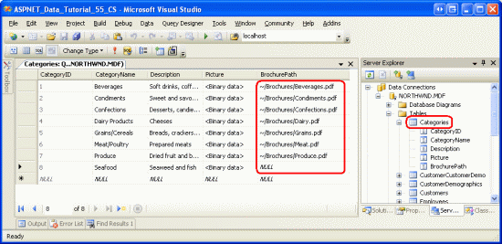](displaying-binary-data-in-the-data-web-controls-vb/_static/image1.png)

**Figure 1**: Manually Enter the Values for the `Categories` Table s `BrochurePath` Column ([Click to view full-size image](displaying-binary-data-in-the-data-web-controls-vb/_static/image2.png))

## Step 2: Providing a Download Link for the Brochures in a GridView

With the `BrochurePath` values provided for the `Categories` table, we re ready to create a GridView that lists each category along with a link to download the category s brochure. In Step 4 we'll extend this GridView to also display the category s image.

Start by dragging a GridView from the Toolbox onto the Designer of the `DisplayOrDownloadData.aspx` page in the `BinaryData` folder. Set the GridView s `ID` to `Categories` and through the GridView s smart tag, choose to bind it to a new data source. Specifically, bind it to an ObjectDataSource named `CategoriesDataSource` that retrieves data using the `CategoriesBLL` object s `GetCategories()` method.

[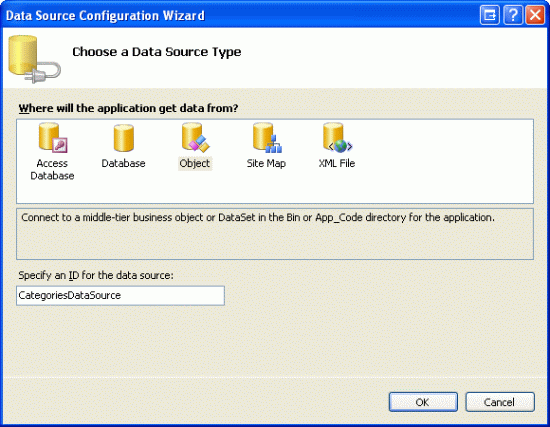](displaying-binary-data-in-the-data-web-controls-vb/_static/image3.png)

**Figure 2**: Create a New ObjectDataSource Named `CategoriesDataSource` ([Click to view full-size image](displaying-binary-data-in-the-data-web-controls-vb/_static/image4.png))

[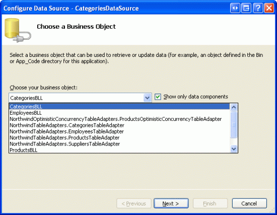](displaying-binary-data-in-the-data-web-controls-vb/_static/image5.png)

**Figure 3**: Configure the ObjectDataSource to Use the `CategoriesBLL` Class ([Click to view full-size image](displaying-binary-data-in-the-data-web-controls-vb/_static/image6.png))

[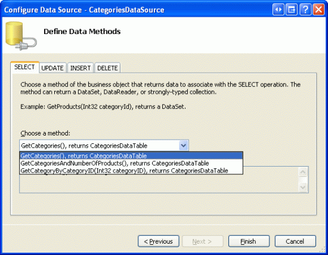](displaying-binary-data-in-the-data-web-controls-vb/_static/image7.png)

**Figure 4**: Retrieve the List of Categories Using the `GetCategories()` Method ([Click to view full-size image](displaying-binary-data-in-the-data-web-controls-vb/_static/image8.png))

After completing the Configure Data Source wizard, Visual Studio will automatically add a BoundField to the `Categories` GridView for the `CategoryID`, `CategoryName`, `Description`, `NumberOfProducts`, and `BrochurePath` `DataColumn` s. Go ahead and remove the `NumberOfProducts` BoundField since the `GetCategories()` method s query does not retrieve this information. Also remove the `CategoryID` BoundField and rename the `CategoryName` and `BrochurePath` BoundFields `HeaderText` properties to Category and Brochure, respectively. After making these changes, your GridView and ObjectDataSource s declarative markup should look like the following:

[!code-aspx[Main](displaying-binary-data-in-the-data-web-controls-vb/samples/sample1.aspx)]

View this page through a browser (see Figure 5). Each of the eight categories is listed. The seven categories with `BrochurePath` values have the `BrochurePath` value displayed in the respective BoundField. Seafood, which has a `NULL` value for its `BrochurePath`, displays an empty cell.

[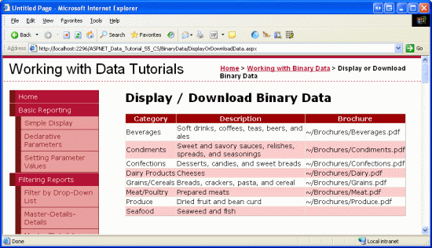](displaying-binary-data-in-the-data-web-controls-vb/_static/image9.png)

**Figure 5**: Each Category s Name, Description, and `BrochurePath` Value is Listed ([Click to view full-size image](displaying-binary-data-in-the-data-web-controls-vb/_static/image10.png))

Rather than displaying the text of the `BrochurePath` column, we want to create a link to the brochure. To accomplish this, remove the `BrochurePath` BoundField and replace it with a HyperLinkField. Set the new HyperLinkField s `HeaderText` property to Brochure, its `Text` property to View Brochure, and its `DataNavigateUrlFields` property to `BrochurePath`.

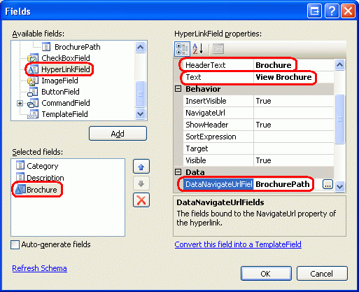

**Figure 6**: Add a HyperLinkField for `BrochurePath`

This will add a column of links to the GridView, as Figure 7 shows. Clicking a View Brochure link will either display the PDF directly in the browser or prompt the user to download the file, depending on whether a PDF reader is installed and the browser s settings.

[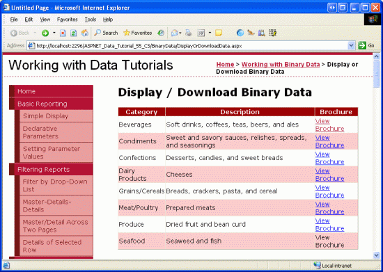](displaying-binary-data-in-the-data-web-controls-vb/_static/image11.png)

**Figure 7**: A Category s Brochure Can Be Viewed by Clicking the View Brochure Link ([Click to view full-size image](displaying-binary-data-in-the-data-web-controls-vb/_static/image12.png))

**Figure 8**: The Category s Brochure PDF is Displayed ([Click to view full-size image](displaying-binary-data-in-the-data-web-controls-vb/_static/image14.png))

## Hiding the View Brochure Text for Categories Without a Brochure

As Figure 7 shows, the `BrochurePath` HyperLinkField displays its `Text` property value ( View Brochure ) for all records, regardless of whether there s a non-`NULL` value for `BrochurePath`. Of course, if `BrochurePath` is `NULL`, then the link is displayed as text only, as is the case with the Seafood category (refer back to Figure 7). Rather than displaying the text View Brochure, it might be nice to have those categories without a `BrochurePath` value display some alternate text, like No Brochure Available.

In order to provide this behavior, we need to use a TemplateField whose content is generated via a call to a page method that emits the appropriate output based on the `BrochurePath` value. We first explored this formatting technique back in the [Using TemplateFields in the GridView Control](../custom-formatting/using-templatefields-in-the-gridview-control-vb.md) tutorial.

Turn the HyperLinkField into a TemplateField by selecting the `BrochurePath` HyperLinkField and then clicking on the Convert this field into a TemplateField link in the Edit Columns dialog box.

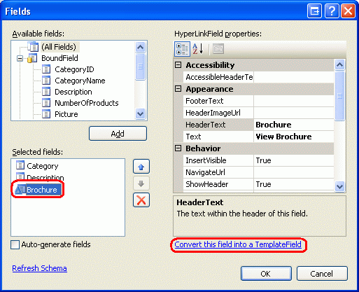

**Figure 9**: Convert the HyperLinkField into a TemplateField

This will create a TemplateField with an `ItemTemplate` that contains a HyperLink Web control whose `NavigateUrl` property is bound to the `BrochurePath` value. Replace this markup with a call to the method `GenerateBrochureLink`, passing in the value of `BrochurePath`:

[!code-aspx[Main](displaying-binary-data-in-the-data-web-controls-vb/samples/sample2.aspx)]

Next, create a `Protected` method in the ASP.NET page s code-behind class named `GenerateBrochureLink` that returns a `String` and accepts an `Object` as an input parameter.

[!code-vb[Main](displaying-binary-data-in-the-data-web-controls-vb/samples/sample3.vb)]

This method determines if the passed-in `Object` value is a database `NULL` and, if so, returns a message indicating that the category lacks a brochure. Otherwise, if there is a `BrochurePath` value, it s displayed in a hyperlink. Note that if the `BrochurePath` value is present it s passed into the [`ResolveUrl(url)` method](https://msdn.microsoft.com/library/system.web.ui.control.resolveurl.aspx). This method resolves the passed-in *url*, replacing the `~` character with the appropriate virtual path. For example, if the application is rooted at `/Tutorial55`, `ResolveUrl("~/Brochures/Meats.pdf")` will return `/Tutorial55/Brochures/Meat.pdf`.

Figure 10 shows the page after these changes have been applied. Note that the Seafood category s `BrochurePath` field now displays the text No Brochure Available .

[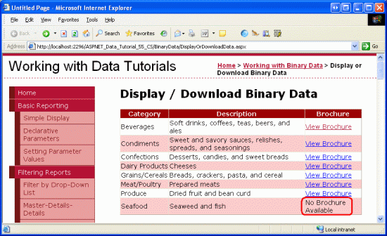](displaying-binary-data-in-the-data-web-controls-vb/_static/image15.png)

**Figure 10**: The Text No Brochure Available is Displayed for Those Categories Without a Brochure ([Click to view full-size image](displaying-binary-data-in-the-data-web-controls-vb/_static/image16.png))

## Step 3: Adding a Web Page to Display a Category s Picture

When a user visits an ASP.NET page, they receive the ASP.NET page s HTML. The received HTML is just text and does not contain any binary data. Any additional binary data, such as images, sound files, Macromedia Flash applications, embedded Windows Media Player videos, and so forth, exist as separate resources on the web server. The HTML contains references to these files, but does not include the actual contents of the files.

For example, in HTML the `` element is used to reference a picture, with the `src` attribute pointing to the image file like so:

[!code-html[Main](displaying-binary-data-in-the-data-web-controls-vb/samples/sample4.html)]

When a browser receives this HTML, it makes another request to the web server to retrieve the binary contents of the image file, which it then displays in the browser. The same concept applies to any binary data. In Step 2, the brochure was not sent down to the browser as part of the page s HTML markup. Rather, the rendered HTML provided hyperlinks that, when clicked, caused the browser to request the PDF document directly.

To display or allow users to download binary data that resides within the database, we need to create a separate web page that returns the data. For our application, there s only one binary data field stored directly in the database the category s picture. Therefore, we need a page that, when called, returns the image data for a particular category.

Add a new ASP.NET page to the `BinaryData` folder named `DisplayCategoryPicture.aspx`. When doing so, leave the Select master page checkbox unchecked. This page expects a `CategoryID` value in the querystring and returns the binary data of that category s `Picture` column. Since this page returns binary data and nothing else, it does not need any markup in the HTML section. Therefore, click on the Source tab in the lower left corner and remove all of the page s markup except for the `<%@ Page %>` directive. That is, `DisplayCategoryPicture.aspx` s declarative markup should consist of a single line:

[!code-aspx[Main](displaying-binary-data-in-the-data-web-controls-vb/samples/sample5.aspx)]

If you see the `MasterPageFile` attribute in the `<%@ Page %>` directive, remove it.

In the page s code-behind class, add the following code to the `Page_Load` event handler:

[!code-vb[Main](displaying-binary-data-in-the-data-web-controls-vb/samples/sample6.vb)]

This code starts by reading in the `CategoryID` querystring value into a variable named `categoryID`. Next, the picture data is retrieved via a call to the `CategoriesBLL` class s `GetCategoryWithBinaryDataByCategoryID(categoryID)` method. This data is returned to the client by using the `Response.BinaryWrite(data)` method, but before this is called, the `Picture` column value s OLE header must be removed. This is accomplished by creating a `Byte` array named `strippedImageData` that will hold precisely 78 characters less than what is in the `Picture` column. The [`Array.Copy` method](https://msdn.microsoft.com/library/z50k9bft.aspx) is used to copy the data from `category.Picture` starting at position 78 over to `strippedImageData`.

The `Response.ContentType` property specifies the [MIME type](http://en.wikipedia.org/wiki/MIME) of the content being returned so that the browser knows how to render it. Since the `Categories` table s `Picture` column is a bitmap image, the bitmap MIME type is used here (image/bmp). If you omit the MIME type, most browsers will still display the image correctly because they can infer the type based on the contents of the image file s binary data. However, it s prudent to include the MIME type when possible. See the [Internet Assigned Numbers Authority s website](http://www.iana.org/) for a complete listing of [MIME media types](http://www.iana.org/assignments/media-types/).

With this page created, a particular category s picture can be viewed by visiting `DisplayCategoryPicture.aspx?CategoryID=categoryID`. Figure 11 shows the Beverages category s picture, which can be viewed from `DisplayCategoryPicture.aspx?CategoryID=1`.

[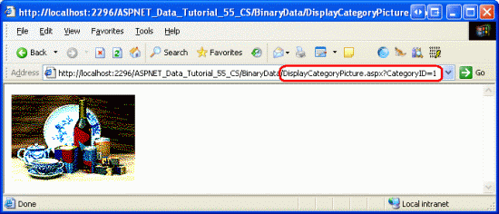](displaying-binary-data-in-the-data-web-controls-vb/_static/image17.png)

**Figure 11**: The Beverages Category s Picture is Displayed ([Click to view full-size image](displaying-binary-data-in-the-data-web-controls-vb/_static/image18.png))

If, when visiting `DisplayCategoryPicture.aspx?CategoryID=categoryID`, you get an exception that reads Unable to cast object of type 'System.DBNull' to type 'System.Byte[]', there are two things that may be causing this. First, the `Categories` table s `Picture` column does allow `NULL` values. The `DisplayCategoryPicture.aspx` page, however, assumes there is a non-`NULL` value present. The `Picture` property of the `CategoriesDataTable` cannot be directly accessed if it has a `NULL` value. If you do want to allow `NULL` values for the `Picture` column, you d want to include the following condition:

[!code-vb[Main](displaying-binary-data-in-the-data-web-controls-vb/samples/sample7.vb)]

The above code assumes that there s some image file named `NoPictureAvailable.gif` in the `Images` folder that you want to display for those categories without a picture.

This exception could also be caused if the `CategoriesTableAdapter` s `GetCategoryWithBinaryDataByCategoryID` method s `SELECT` statement has reverted back to the main query s column list, which can happen if you are using ad-hoc SQL statements and you ve re-run the wizard for the TableAdapter s main query. Check to ensure that `GetCategoryWithBinaryDataByCategoryID` method s `SELECT` statement still includes the `Picture` column.

> [!NOTE]
> Every time the `DisplayCategoryPicture.aspx` is visited, the database is accessed and the specified category s picture data is returned. If the category s picture hasn't changed since the user has last viewed it, though, this is wasted effort. Fortunately, HTTP allows for *conditional GETs*. With a conditional GET, the client making the HTTP request sends along an [`If-Modified-Since` HTTP header](http://www.w3.org/Protocols/rfc2616/rfc2616-sec14.html) that provides the date and time the client last retrieved this resource from the web server. If the content has not changed since this specified date, the web server may respond with a [Not Modified status code (304)](http://www.w3.org/Protocols/rfc2616/rfc2616-sec10.html) and forgo sending back the requested resource s content. In short, this technique relieves the web server from having to send back content for a resource if it has not been modified since the client last accessed it.

To implement this behavior, however, requires that you add a `PictureLastModified` column to the `Categories` table to capture when the `Picture` column was last updated as well as code to check for the `If-Modified-Since` header. For more information on the `If-Modified-Since` header and the conditional GET workflow, see [HTTP Conditional GET for RSS Hackers](http://fishbowl.pastiche.org/2002/10/21/http_conditional_get_for_rss_hackers) and [A Deeper Look at Performing HTTP Requests in an ASP.NET Page](https://www.c-sharpcorner.com/UploadFile/ashish_2008/http-requests-in-Asp-Net/).

## Step 4: Displaying the Category Pictures in a GridView

Now that we have a web page to display a particular category s picture, we can display it using the [Image Web control](https://quickstarts.asp.net/QuickStartv20/aspnet/doc/ctrlref/standard/image.aspx) or an HTML `` element pointing to `DisplayCategoryPicture.aspx?CategoryID=categoryID`. Images whose URL is determined by database data can be displayed in the GridView or DetailsView using the ImageField. The ImageField contains `DataImageUrlField` and `DataImageUrlFormatString` properties that work like the HyperLinkField s `DataNavigateUrlFields` and `DataNavigateUrlFormatString` properties.

Let s augment the `Categories` GridView in `DisplayOrDownloadData.aspx` by adding an ImageField to show each category s picture. Simply add the ImageField and set its `DataImageUrlField` and `DataImageUrlFormatString` properties to `CategoryID` and `DisplayCategoryPicture.aspx?CategoryID={0}`, respectively. This will create a GridView column that renders an `` element whose `src` attribute references `DisplayCategoryPicture.aspx?CategoryID={0}`, where {0} is replaced with the GridView row s `CategoryID` value.

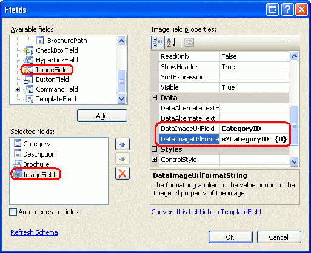

**Figure 12**: Add an ImageField to the GridView

After adding the ImageField, your GridView s declarative syntax should look like soothe following:

[!code-aspx[Main](displaying-binary-data-in-the-data-web-controls-vb/samples/sample8.aspx)]

Take a moment to view this page through a browser. Note how each record now includes a picture for the category.

[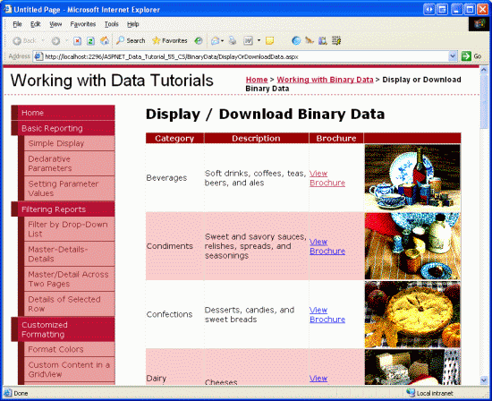](displaying-binary-data-in-the-data-web-controls-vb/_static/image19.png)

**Figure 13**: The Category s Picture is Displayed for Each Row ([Click to view full-size image](displaying-binary-data-in-the-data-web-controls-vb/_static/image20.png))

## Summary

In this tutorial we examined how to present binary data. How the data is presented depends on the type of data. For the PDF brochure files, we offered the user a View Brochure link that, when clicked, took the user directly to the PDF file. For the category s picture, we first created a page to retrieve and return the binary data from the database and then used that page to display each category s picture in a GridView.

Now that we ve looked at how to display binary data, we re ready to examine how to perform insert, updates, and deletes against the database with the binary data. In the next tutorial we'll look at how to associate an uploaded file with its corresponding database record. In the tutorial after that, we'll see how to update existing binary data as well as how to delete the binary data when its associated record is removed.

Happy Programming!

## About the Author

[Scott Mitchell](http://www.4guysfromrolla.com/ScottMitchell.shtml), author of seven ASP/ASP.NET books and founder of [4GuysFromRolla.com](http://www.4guysfromrolla.com), has been working with Microsoft Web technologies since 1998. Scott works as an independent consultant, trainer, and writer. His latest book is [*Sams Teach Yourself ASP.NET 2.0 in 24 Hours*](https://www.amazon.com/exec/obidos/ASIN/0672327384/4guysfromrollaco). He can be reached at [mitchell@4GuysFromRolla.com.](mailto:mitchell@4GuysFromRolla.com) or via his blog, which can be found at [http://ScottOnWriting.NET](http://ScottOnWriting.NET).

## Special Thanks To

This tutorial series was reviewed by many helpful reviewers. Lead reviewers for this tutorial were Teresa Murphy and Dave Gardner. Interested in reviewing my upcoming MSDN articles? If so, drop me a line at [mitchell@4GuysFromRolla.com.](mailto:mitchell@4GuysFromRolla.com)

> [!div class="step-by-step"]
> [Previous](uploading-files-vb.md)
> [Next](including-a-file-upload-option-when-adding-a-new-record-vb.md)
