# The Top Features in ASP.NET Web Pages 2

by [Microsoft](https://github.com/microsoft)

> This article provides an overview of the top new features in the ASP.NET Web Pages 2 RC, a lightweight web programming framework that is included with [Microsoft WebMatrix 2 RC](https://www.microsoft.com/web/).
> 
> **What's included:** 
> 
> - [Installing WebMatrix](#install)
> - [New and enhanced features](#New_and_Enhanced_Features)
> 
>     - [Changes for the RC release](#Changes_for_the_RC_Version)
>     - [Changes for the Beta release](#Changes_for_the_Beta_Version)
>     - [Using the New and Updated Site Templates](#templates)
>     - [Validating User Input](#validation)
>     - [Enabling logins from Facebook and other sites using OAuth and OpenID](#oauthsetup)
>     - [Adding Maps using the Maps Helper](#maphelper)
>     - [Running Web Pages Applications Side by Side](#sidebyside)
>     - [Rendering Pages for Mobile Devices](#mobile)
> - [Additional Resources](#resources)
> 
> > [!NOTE]
> > This topic assumes that you are using WebMatrix to work with your ASP.NET Web Pages 2 code. However, as with Web Pages 1, you can also create Web Pages 2 websites using Visual Studio, which gives you enhanced IntelliSense capabilities and debugging. To work with Web Pages in Visual Studio, you must first install Visual Studio 2010 SP1, Visual Web Developer Express 2010 SP1, or Visual Studio 11 Beta. Then install the ASP.NET MVC 4 Beta, which includes templates and tools for creating ASP.NET MVC 4 and Web Pages 2 applications in Visual Studio.
> 
> 
> *Last update: 18 June 2012*

## Installing WebMatrix

To install Web Pages, you can use the Microsoft Web Platform Installer, which is a free application that makes it easy to install and configure web-related technologies. You will install the WebMatrix 2 Beta, which includes Web Pages 2 Beta.

1. Browse to the installation page for the latest version of the Web Platform Installer:

    [https://go.microsoft.com/fwlink/?LinkId=226883](https://go.microsoft.com/fwlink/?LinkId=226883)

    > [!NOTE]
    > If you already have WebMatrix 1 installed, this installation updates it to WebMatrix 2 Beta. You can run websites that were created using version 1 or 2 on the same computer. For more information, see the section on [Running Web Pages Applications Side by Side](#sidebyside).
2. Choose **Install Now**. 

    If you use Internet Explorer, go to the next step. If you use a different browser like Mozilla Firefox or Google Chrome, you are prompted to save the *Webmatrix.exe* file to your computer. Save the file and then click it to launch the installer.
3. Run the installer and choose the **Install** button. This installs WebMatrix and Web Pages.

##   New and Enhanced Features

###   Changes for the RC Version (June 2012)

The RC version release in June 2012 has a few changes from the Beta version refresh that was released in March 2012. These changes are:

- A `Validation.AddFormError` method was added to the `Validation` helper. This is useful if you perform validation manually (for example, you validate a value that is passed in the query string) and you want to add an error message that can be displayed by the `Html.ValidationSummary` method. For more information, see the section [Validating Data That Doesn't Come Directly From Users](https://go.microsoft.com/fwlink/?LinkId=253002#Validating_Data_That_Doesnt_Come_Directly_from_Users) in [Validating User Input in ASP.NET Web Pages (Razor) Sites](https://go.microsoft.com/fwlink/?LinkId=253002).
- The functionality for bundling and minification has been removed from the core ASP.NET Web Pages 2 assemblies. As a consequence, the `Assets` helper listed later in this document is not available. Instead, you must install the [ASP.NET Optimization](http://nuget.org/packages/Microsoft.Web.Optimization/0.1) NuGet package. For more information, see [Bundling and Minifying Assets in an ASP.NET Web Pages (Razor) Site](https://go.microsoft.com/fwlink/?LinkId=255373).
- Additional assemblies to support ASP.NET Web Pages 2 have been added. The only noticeable effect of this change is that you might see more assemblies in a site's *bin* folder after you create a site or deploy a site to a hosting provider.

### Changes for the Beta Version (February 2012)

The Beta version released in February 2012 has only a few changes from the Beta version that was released in December 2011. These changes are:

- Razor now supports conditional attributes. In an HTML element, if you set an attribute to a value that resolves in server code to `false` or `null`, ASP.NET does not render the attribute at all. For example, imagine you have the following markup for a check box:

    [!code-html[Main](top-features-in-web-pages-2/samples/sample1.html)]

    If the value of `checked1` resolves to `false` or to `null`, the `checked` attribute is not rendered. This is a breaking change.
- The `Validation.GetHtml` method has been renamed to `Validation.For`. This is a breaking change; `Validation.GetHtml` will not work in the Beta release.
- You can now include the `~` operator in markup to reference the site root without using the `Href` function. (That is, the Razor parser can now find and resolve the `~` operator without requiring an explicit method call to `Href`.) The `Href` method still works, so this is not a breaking change.

    For example, if you previously had markup like this:

    `<a href="@Href("~/Default.cshtml")">Home</a>`

    You can now use markup like this:

    `<a href="~/Default.cshtml">Home</a>`
- The `Scripts` helper for assets (resource) management has been replaced with the `Assets` helper, which has slightly different methods, such as the following:

  - For `Scripts.Add`, use `Assets.AddScript`
  - For `Scripts.GetScriptTags`, use `Assets.GetScripts`

    This is a breaking change; the `Scripts` class is not available in the Beta release. The code examples in this document that use asset management have been updated with this change.

### Using the New and Updated Site Templates

The **Starter Site** template has been updated so that it runs on Web Pages 2 by default. It also includes the following new capabilities:

- Mobile-friendly page rendering. Through the use of CSS styles and the `@media` selector, the **Starter Site** provides improved rendering of pages on smaller screens, including mobile device screens.
- Improved membership and authentication options. You can let users log into your site using their accounts from other social networking sites, such as Twitter, Facebook, and Windows Live. For more information, see the [Enabling Logins from Facebook and Other Sites using OAuth and OpenID](#oauthsetup) section.
- HTML5 elements.

The new **Personal Site** template lets you create a website that contains a personal blog, a photos page, and a Twitter page. You can customize a site based on the **Personal Site** template by doing the following:

- Change the look of the site by editing the layout file (*\_SiteLayout.cshtml*) and the styles file (*Site.css*).
- Install NuGet packages that add functionality to your site. For information about how to install packages, including the ASP.NET Web Helpers Library, see the tutorial about [installing helpers](https://go.microsoft.com/fwlink/?LinkId=202889#webhelpers).

To access the **Personal Site** template, choose **Templates** on the WebMatrix **Quick Start** screen.

[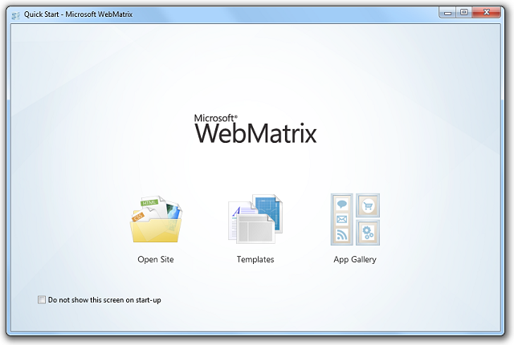](top-features-in-web-pages-2/_static/image1.png)

In the **Templates** dialog box, choose the **Personal Site** template.

[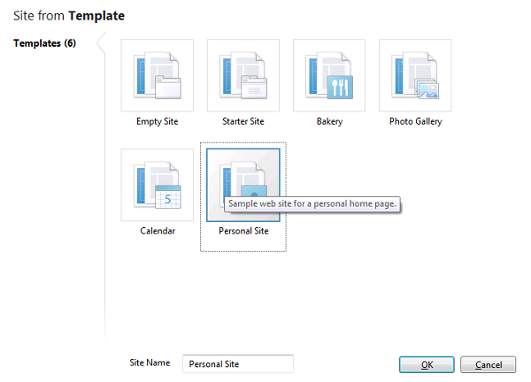](top-features-in-web-pages-2/_static/image3.png)

The landing page of the **Personal Site** template lets you follow links to set up your blog, Twitter page, and photos page.

[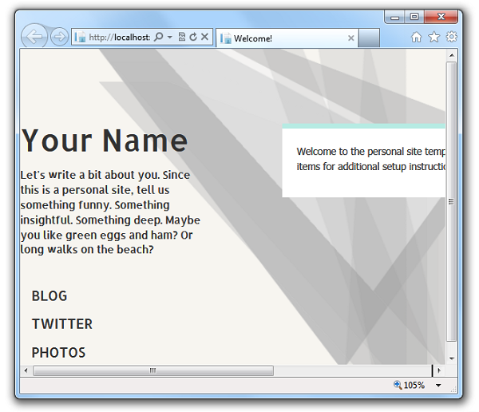](top-features-in-web-pages-2/_static/image5.png)

### Validating User Input

In Web Pages 1, to validate user input on submitted forms, you use the `System.Web.WebPages.Html.ModelState` class. (This is illustrated in several of the code samples in the Web Pages 1 tutorial titled [Working with Data](../data/5-working-with-data.md).) You can still use this approach in Web Pages 2. However, Web Pages 2 also offers improved tools for validating user input:

- New validation classes, including `System.Web.WebPages.ValidationHelper` and `System.Web.WebPages.Validator`, that let you do powerful validation tasks with a few lines of code.
- Optionally, client-side validation, which provides immediate feedback to the user instead of requiring a round trip to the server to check for validation errors. (For security reasons, validation is performed on the server even if the checks have been performed in the client beforehand.)

To use the new validation features, do the following:

In the page's code, register an element to be validated by using methods of the `Validation` helper: `Validation.RequireField`, `Validation.RequireFields` (to register multiple elements to be required), or `Validation.Add`. The `Add` method lets you specify other types of validation checks, like data-type checking, comparing entries in different fields, string-length checks, and patterns (using regular expressions). Here are some examples:

[!code-html[Main](top-features-in-web-pages-2/samples/sample2.html)]

To display a field-specific error, call `Html.ValidationMessage` in the markup for each element being validated:

[!code-cshtml[Main](top-features-in-web-pages-2/samples/sample3.cshtml)]

To display a summary (`<ul>` list) of all the errors in the page, `Html.ValidationSummary` in the markup:

[!code-cshtml[Main](top-features-in-web-pages-2/samples/sample4.cshtml)]

These steps are enough to implement server-side validation. If you want to add client-side validation, do the following in addition.

Add the following script file references inside the `<head>` section of a web page. The first two script references point to remote files on a content delivery network (CDN) server. The third reference points to a local script file. Production apps should implement a fallback when the CDN is unavailable. Test the fallback.

[!code-html[Main](top-features-in-web-pages-2/samples/sample5.html)]

The easiest way to get a local copy of the *jquery.validate.unobtrusive.min.js* library is to create a new Web Pages site based on one of the site templates (such as Starter Site). The site created by the template includes *jquery.validate.unobtrusive.js* file in its Scripts folder, from which you can copy it to your site.

If your website uses a *\_SiteLayout* page to control the page layout, you can include these script references in that page so that validation is available to all content pages. If you want to perform validation only on particular pages, you can use the assets manager to register the scripts on only those pages. To do this, call `Assets.AddScript(path)` in the page that you want to validate and reference each of the script files. Then add a call to `Assets.GetScripts` in the *\_SiteLayout* page in order to render the registered `<script>` tags. For more information, see the section [Registering Scripts with the Assets Manager](#resmanagement).

In the markup for an individual element, call the `Validation.For` method. This method emits attributes that jQuery can hook in order to provide client-side validation. For example:

[!code-cshtml[Main](top-features-in-web-pages-2/samples/sample6.cshtml)]

The following example shows a page that validates user input on a form. To run and test this validation code, do this:

1. Create a new web site using one of the WebMatrix 2 site templates that includes a *Scripts* folder, such as the **Starter Site** template.
2. In the new site, create a new *.cshtml* page, and replace the contents of the page with the following code.
3. Run the page in a browser. Enter valid and invalid values to see the effects on validation. For example, leave a required field blank or enter a letter in the **Credits** field.

[!code-cshtml[Main](top-features-in-web-pages-2/samples/sample7.cshtml)]

Here is the page when a user submits valid input:

[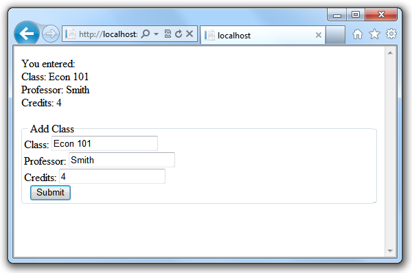](top-features-in-web-pages-2/_static/image7.png)

Here is the page when a user submits it with a required field left empty:

Here is the page when a user submits it with something other than an integer in the **Credits** field:

[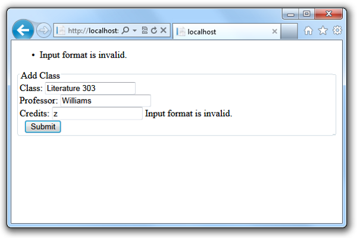](top-features-in-web-pages-2/_static/image11.png)

For more information, see the following blog posts:

- [Updated validation in Web Pages v2](http://mikepope.com/blog/DisplayBlog.aspx?permalink=2344) Basics of adding validation using the `Validation` helper (server-side only)
- [Updated validation in Web Pages v2, Part 2](http://www.mikepope.com/blog/DisplayBlog.aspx?permalink=2347) Adding client-side validation.
- [Updated validation in Web Pages v2, Part 3](http://mikepope.com/blog/DisplayBlog.aspx?permalink=2351) Formatting validation errors.

### Registering Scripts Using the Assets Manager

The assets manager is a new feature that you can use in server code to register and render client scripts. This feature is helpful when you are working with code from multiple files (such as layout pages, content pages, helpers, etc.) that are combined into a single page at run time. The assets manager coordinates the source files to make sure that script files are referenced correctly and efficiently on the rendered page, regardless of which code files they are called from or how many times they are called. The assets manager also renders `<script>` tags in the right place so that the page can load quickly (without downloading scripts while rendering) and to avoid errors that can occur if scripts are called before rendering is complete.

For example, suppose that you create a custom helper that calls a JavaScript file, and you call this helper at three different places in your content page code. If you don't use the assets manager to register the script calls in the helper, three different `<script>` tags that all point to the same script file will appear in your rendered page. Plus, depending on where the `<script>` tags are inserted in the rendered page, errors may occur if the script tries to access certain page elements before the page fully loads. If you use the assets manager to register the script, you avoid these problems.

You can register a script with the assets manager by doing this:

- In the code that needs to reference the script, call the `Assets.AddScript` method.
- In a *\_SiteLayout* page, call the `Assets.GetScripts` method to render the `<script>` tags. 

    > [!NOTE]
    > Put calls to `Assets.GetScripts` as the very last item in the `<body>` element of the *\_SiteLayout* page. This helps the page load faster and can help avoid script errors.

The following example shows how the assets manager works. The code contains the following items:

- A custom helper named `MakeNote`. This helper renders a string inside a box by wrapping a `div` element around it that's styled with a border and by adding &quot;Note:&quot; to it. The helper also calls a JavaScript file that adds run-time behavior to the note. Rather than reference the script with a `<script>` tag, the helper registers the script by calling `Assets.AddScript` .
- A JavaScript file. This is the file that's called by the helper, and it temporarily increases the font size of note items during a `mouseover` event.
- A content page, which references the *\_SiteLayout* page, renders some content in the body, and then calls the `MakeNote` helper.
- A *\_SiteLayout* page. This page provides a common header and a page layout structure. It also includes a call to `Assets.GetScripts`, which is how the assets manager renders script calls in a page.

To run the sample:

1. Create an empty Web Pages 2 website. You can use the WebMatrix **Empty Site** template for this.
2. Create a folder named *Scripts* in the site.
3. In the *Scripts* folder, create a file named *Test.js*, copy the *Test.js* content into it from the example, and save the file..
4. Create a folder named *App\_Code* in the site.
5. In the *App\_Code* folder, create a file named *Helpers.cshtml*, copy the example code into it, and save it in a folder named *App\_Code* in the root folder.
6. In the site's root folder, create a file named *\_SiteLayout.cshtml,* copy the example into it, and save the file.
7. In the site root, create a file named *ContentPage.cshtml*, add the example code, and save it.
8. Run *ContentPage* in a browser. The string you passed to the `MakeNote` helper is rendered as a boxed note.
9. Pass the mouse pointer over the note. The script temporarily increases the font size of the note.
10. View the source of the rendered page. Because of where you placed the call to `Assets.GetScripts`, the rendered `<script>` tag that calls *Test.js* is the very last item in the body of the page.

*Test.js*

[!code-javascript[Main](top-features-in-web-pages-2/samples/sample8.js)]

*Helpers.cshtml*

[!code-cshtml[Main](top-features-in-web-pages-2/samples/sample9.cshtml)]

*\_SiteLayout.cshtml*

[!code-html[Main](top-features-in-web-pages-2/samples/sample10.html)]

*ContentPage.cshtml*

[!code-cshtml[Main](top-features-in-web-pages-2/samples/sample11.cshtml)]

The following screenshot shows *ContentPage.cshtml* in a browser when you hold the mouse pointer over the note:

[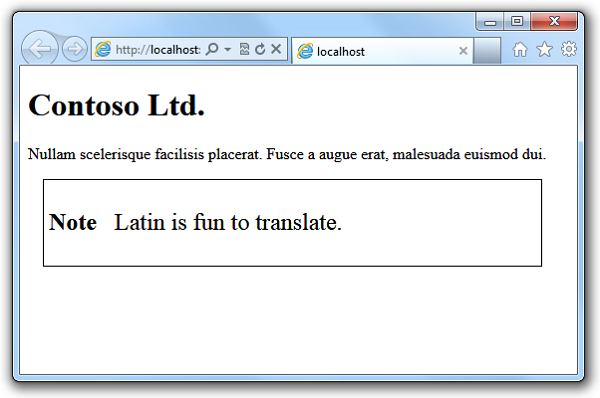](top-features-in-web-pages-2/_static/image13.png)

### Enabling Logins from Facebook and Other Sites Using OAuth and OpenID

Web Pages 2 provides enhanced options for membership and authentication. The main enhancement is that there are new [OAuth](http://oauth.net/) and [OpenID](http://openid.net/) providers. Using these providers, you can let users log into your site using their existing credentials from Facebook, Twitter, Windows Live, Google, and Yahoo. For example, to log in using a Facebook account, users can just choose a Facebook icon, which redirects them to the Facebook login page where they enter their user information. They can then associate the Facebook login with their account on your site. A related enhancement to the Web Pages membership features is that users can associate multiple logins (including logins from social networking sites) with a single account on your website.

This image shows the Login page from the **Starter Site** template, where a user can choose a Facebook, Twitter, or Windows Live icon to enable logging in with an external account:

[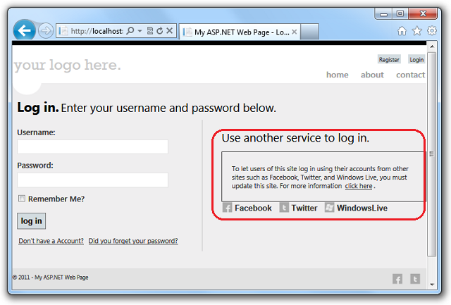](top-features-in-web-pages-2/_static/image15.png)

You can enable OAuth and OpenID membership using just a few lines of code. The methods and properties you use to work with the OAuth and OpenID providers are in the `WebMatrix.Security.OAuthWebSecurity` class.

However, instead of using code to enable logins from other sites, a recommended way to get started with the new providers is to use the new **Starter Site** template that is included with WebMatrix 2 Beta. The **Starter Site** template includes a full membership infrastructure, complete with a login page, a membership database, and all the code you need to let users log into your site using either local credentials or those from another site.

#### How to Enable Logins using the OAuth and OpenID Providers

This section provides an example of how to let users log in from external sites (Facebook, Twitter, Windows Live, Google, or Yahoo) to a site that's based on the **Starter Site** template. After creating a starter site, you do this (details follow):

- For the sites that use an OAuth provider (Facebook, Twitter, and Windows Live), create an application on the external site. This gives you application keys that you'll need in order to invoke the login feature for those sites. For sites that use an OpenID provider (Google, Yahoo), you do not have to create an application. For all of these sites, you must have an account in order to log in and to create developer applications. 

    > [!NOTE]
    > Windows Live applications only accept a live URL for a working website, so you cannot use a local website URL for testing logins.
- Edit a few files in your website in order to specify the appropriate authentication provider and to submit a login to the site you want to use.

**To enable Google and Yahoo logins**:

1. In your website, edit the *\_AppStart.cshtml* page and add the following two lines of code in the Razor code block after the call to the `WebSecurity.InitializeDatabaseConnection` method. This code enables both the Google and Yahoo OpenID providers. 

    [!code-css[Main](top-features-in-web-pages-2/samples/sample12.css)]
2. In the *~/Account/Login.cshtml* page, remove the comments from the following `<fieldset>` block of markup near the end of the page. To uncomment the code, remove the `@*` characters that precede and follow the `<fieldset>` block. The resulting code block looks like this:

    [!code-html[Main](top-features-in-web-pages-2/samples/sample13.html)]
3. Add an `<input>` element for the Google or Yahoo provider to the `<fieldset>` group in the *~/Account/Login.cshtml* page. The updated `<fieldset>` group with `<input>` elements for both Google and Yahoo looks like the following example: 

    [!code-html[Main](top-features-in-web-pages-2/samples/sample14.html)]
4. In the *~/Account/AssociateServiceAccount.cshtml* page, add `<input>` elements for Google or Yahoo to the `<fieldset>` group near the end of the file. You can copy the same `<input>` elements that you just added to the `<fieldset>` section in the *~/Account/Login.cshtml* page. 

    The *~/Account/AssociateServiceAccount.cshtml* page in the Starter Site template can be used if you want to create a page on which users can associate multiple logins from other sites with a single account on your website.

Now you can test Google and Yahoo logins.

1. Run the *default.cshtml* page of your site and choose the **Log in** button.
2. On the *Login* page, in the **Use another service to log in** section, choose either the **Google** or **Yahoo** submit button. This example uses the Google login. 

    The web page redirects the request to the Google login page.

    [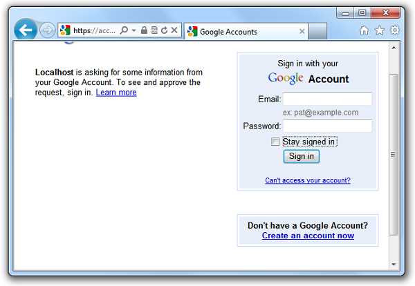](top-features-in-web-pages-2/_static/image17.png)
3. Enter credentials for an existing Google account.
4. If Google asks you whether you want to allow Localhost to use information from the account, click **Allow**.

    The code uses the Google token to authenticate the user, and then returns to this page on your website. This page lets users associate their Google login with an existing account on your website, or they can register a new account on your site to associate the external login with.

    
5. Choose the **Associate** button. The browser returns to your application's home page.

    

    

**To enable Facebook logins**:

1. Go to the [Facebook developers site](https://developers.facebook.com/apps) (log in if you're not already logged in).
2. Choose the **Create New App** button, and then follow the prompts to name and create the new application.
3. In the section **Select how your app will integrate with Facebook**, choose the **Website** section.
4. Fill in the **Site URL** field with the URL of your site (for example, [`http://www.example.com`](http://www.example.com)). The **Domain** field is optional; you can use this to provide authentication for an entire domain (such as *example.com*). 

    > [!NOTE]
    > If you are running a site on your local computer with a URL like `http://localhost:12345` (where the number is a local port number), you can add this value to the **Site URL** field for testing your site. However, any time the port number of your local site changes, you will need to update the **Site URL** field of your application.
5. Choose the **Save Changes** button.
6. Choose the **Apps** tab again, and then view the start page for your application.
7. Copy the **App ID** and **App Secret** values for your application and paste them into a temporary text file. You will pass these values to the Facebook provider in your website code.
8. Exit the Facebook developer site.

Now you make changes to two pages in your website so that users will able to log into the site using their Facebook accounts.

1. In your website, edit the *\_AppStart.cshtml* page and uncomment the code for the Facebook OAuth provider. The uncommented code block looks like the following: 

    [!code-xml[Main](top-features-in-web-pages-2/samples/sample15.xml)]
2. Copy the **App ID** value from the Facebook application as the value of the `consumerKey` parameter (inside the quotation marks).
3. Copy **App Secret** value from the Facebook application as the `consumerSecret` parameter value.
4. Save and close the file.
5. Edit the *~/Account/Login.cshtml* page and remove the comments from the `<fieldset>` block near the end of the page. To uncomment the code, remove the `@*` characters that precede and follow the `<fieldset>` block. The code block with comments removed looks like the following: 

    [!code-html[Main](top-features-in-web-pages-2/samples/sample16.html)]
6. Save and close the file.

Now you can test the Facebook login.

1. Run the site's *default.cshtml* page and choose the **Login** button.
2. On the *Login* page, in the **Use another service to log in** section, choose the **Facebook** icon. 

    The web page redirects the request to the Facebook login page.

    [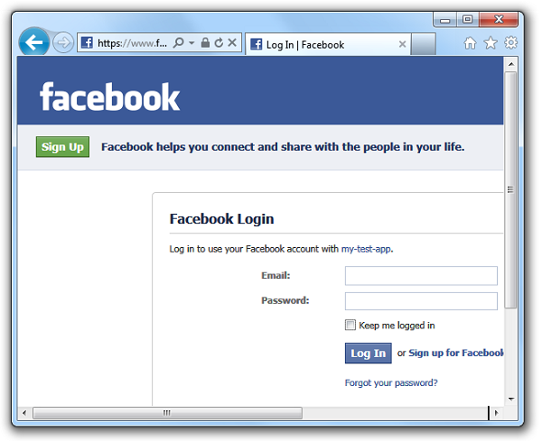](top-features-in-web-pages-2/_static/image25.png)
3. Log into a Facebook account. 

    The code uses the Facebook token to authenticate you and then returns to a page where you can associate your Facebook login with your site's login. Your user name or email address is filled into the **Email** field on the form.

    
4. Choose the **Associate** button. 

    The browser returns to the home page and you are logged in.

    [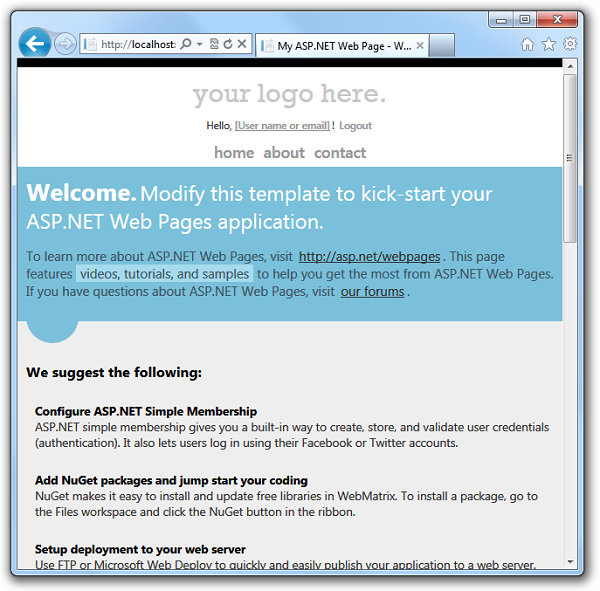](top-features-in-web-pages-2/_static/image29.png)

**To enable Twitter logins:** 

1. Browse to the [Twitter developers site](https://dev.twitter.com/).
2. Choose the **Create an App** link and then log into the site.
3. On the **Create an Application** form, fill in the **Name** and **Description** fields.
4. In the **WebSite** field, enter the URL of your site (for example, [`http://www.example.com`](http://www.example.com)). 

    > [!NOTE]
    > If you're testing your site locally (using a URL like `http://localhost:12345`), Twitter might not accept the URL. However, you might be able to use the local loopback IP address (for example `http://127.0.0.1:12345`). This simplifies the process of testing your application locally. However, every time the port number of your local site changes, you'll need to update the **WebSite** field of your application.
5. In the **Callback URL** field, enter a URL for the page in your website that you want users to return to after logging into Twitter. For example, to send users to the home page of the Starter Site (which will recognize their logged-in status), enter the same URL that you entered in the **WebSite** field.
6. Accept the terms and choose the **Create your Twitter application** button.
7. On the **My Applications** landing page, choose the application you created.
8. On the **Details** tab, scroll to the bottom and choose the **Create My Access Token** button.
9. On the **Details** tab, copy the **Consumer Key** and **Consumer Secret** values for your application and paste them into a temporary text file. You'll pass these values to the Twitter provider in your website code.
10. Exit the Twitter site.

Now you make changes to two pages in your website so that users will be able to log into the site using their Twitter accounts.

1. In your website, edit the *\_AppStart.cshtml* page and uncomment the code for the Twitter OAuth provider. The uncommented code block looks like this: 

    [!code-csharp[Main](top-features-in-web-pages-2/samples/sample17.cs)]
2. Copy the **Consumer Key** value from the Twitter application as the value of the `consumerKey` parameter (inside the quotation marks).
3. Copy the **Consumer Secret** value from the Twitter application as the value of the `consumerSecret` parameter.
4. Save and close the file.
5. Edit the *~/Account/Login.cshtml* page and remove the comments from the `<fieldset>` block near the end of the page. To uncomment the code, remove the `@*` characters that precede and follow the `<fieldset>` block. The code block with comments removed looks like the following: 

    [!code-html[Main](top-features-in-web-pages-2/samples/sample18.html)]
6. Save and close the file.

Now you can test the Twitter login.

1. Run the *default.cshtml* page of your site and choose the **Login** button.
2. On the *Login* page, in the **Use another service to log in** section, choose the **Twitter** icon. 

    The web page redirects the request to a Twitter login page for the application you created.

    [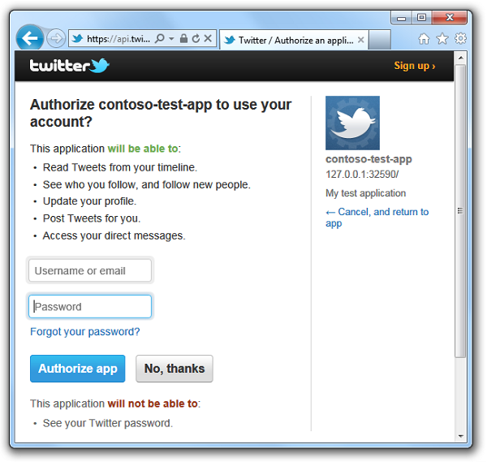](top-features-in-web-pages-2/_static/image31.png)
3. Log into a Twitter account.
4. The code uses the Twitter token to authenticate the user and then returns you to a page where you can associate your login with your website account. Your name or email address is filled into the **Email** field on the form.

    [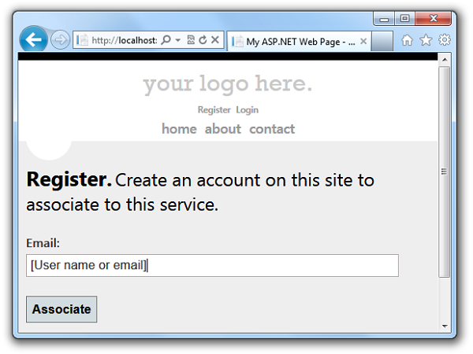](top-features-in-web-pages-2/_static/image33.png)
5. Choose the **Associate** button. 

    The browser returns to the home page and you are logged in.

    

### Adding Maps Using the Maps Helper

Web Pages 2 includes additions to the ASP.NET Web Helpers Library, which is a package of add-ins for a Web Pages site. One of these is a mapping component provided by the `Microsoft.Web.Helpers.Maps` class. You can use the `Maps` class to generate maps based either on an address or on a set of longitude and latitude coordinates. The `Maps` class lets you call directly into popular map engines including Bing, Google, MapQuest, and Yahoo.

To use the new `Maps` class in your website, you must first install the version 2 of the Web Helpers Library. To do this, go to the instructions for installing the currently released version of the [ASP.NET Web Helpers Library](https://go.microsoft.com/fwlink/?LinkId=202889#webhelpers) and install version 2.

The steps for adding mapping to a page are the same regardless of which of the map engines you call. You just add a JavaScript file reference to your mapping page and then add a call that renders the `<script>` tags on your page. Then on your mapping page, call the map engine you want to use.

The following example shows how to create a page that renders a map based on an address, and another page that renders a map based on longitude and latitude coordinates. The address mapping example uses Google Maps, and the coordinate mapping example uses Bing Maps. Note the following elements in the code:

- The call to `Assets.AddScript` at the top of the two mapping pages. This method adds a reference to the *jquery-1.6.2.min.js* file that is included with the **Starter Site** template and that's required by the `Maps` class.
- The call to the `Assets.GetScripts` method in the layout file. This method renders the `<script>` tag on the two mapping pages.
- The call to the `@Maps.GetGoogleHtml` and the `@Maps.GetBingHtml` methods in the mapping pages. To map an address, you must pass an address string. To map coordinates, you must pass longitude and latitude coordinates. For the Bing Maps engine, you must also pass a key (which you get for free by signing up at the [Bing Maps Developers site](https://www.microsoft.com/maps/developers/web.aspx)). The methods for the other map engines work in a similar way (`@Maps.GetYahooHtml`, `@Maps.GetMapQuestHtml`).

To create mapping pages:

1. Create a website based on the **Starter Site** template.
2. Create a file named *MapAddress.cshtml* in the root of the site. This page will generate a map based on an address that you pass to it.
3. Copy the following code into the file, overwriting the existing content. 

    [!code-cshtml[Main](top-features-in-web-pages-2/samples/sample19.cshtml)]
4. Create a file named *\_MapLayout.cshtml* in the root of the site. This page will be the layout page for the two mapping pages.
5. Copy the following code into the file, overwriting the existing content. 

    [!code-html[Main](top-features-in-web-pages-2/samples/sample20.html)]
6. Create a file named *MapCoordinates.cshtml* in the root of the site. This page will generate a map based on a set of coordinates that you pass to it.
7. Copy the following code into the file, overwriting the existing content. 

    [!code-cshtml[Main](top-features-in-web-pages-2/samples/sample21.cshtml)]

To test your mapping pages:

1. Run the page *MapAddress.cshtml* file.
2. Enter a full address string including a street address, state or province, and postal code, and then choose the **Map It** button. The page renders a map from Google Maps: 

    [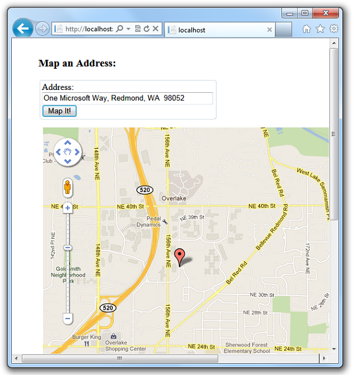](top-features-in-web-pages-2/_static/image37.png)
3. Find a set of latitude and longitude coordinates for a specific location.
4. Run the page *MapCoordinates.cshtml*. Enter the coordinates and then choose the **Map It** button. The page renders a map from Bing Maps: 

    [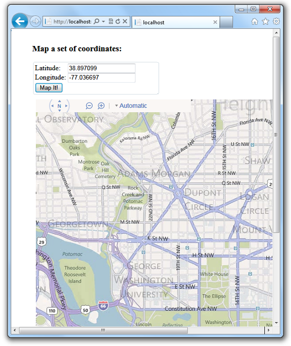](top-features-in-web-pages-2/_static/image39.png)

### Running Web Pages Applications Side by Side

Web Pages 2 adds the ability to run applications side by side. This lets you continue to run your Web Pages 1 applications, build new Web Pages 2 applications, and run all of them on the same computer.

Here are some things to remember when you install the Web Pages 2 Beta with WebMatrix:

- By default, existing Web Pages applications will run as version 2 applications on your computer. (The assemblies for version 2 are installed in the GAC and will be used automatically.)
- If you want to run a site using Web Pages version 1 (instead of the default, as in the previous point), you can configure the site to do that. If your site doesn't already have a *web.config* file in the root of the site, create a new one and copy the following XML into it, overwriting the existing content. If the site already contains a *web.config* file, add an `<appSettings>` element like the following one to the `<configuration>` section.

    [!code-xml[Main](top-features-in-web-pages-2/samples/sample22.xml)]
  `- If you do not specify a version in the *web.config* file, a site is deployed as a version 2 site. (The version 2 assemblies are copied to the *bin* folder in the deployed site.)
- New applications that you create using the site templates in Web Matrix version 2 Beta include the Web Pages version 2 assemblies in the site's *bin* folder.

In general, you can always control which version of Web Pages to use with your site by using NuGet to install the appropriate assemblies into the site's *bin* folder. To find packages, visit [NuGet.org](http://NuGet.org).

### Rendering Pages for Mobile Devices

Web Pages 2 lets you create custom displays for rendering content on mobile or other devices.

The `System.Web.WebPages` namespace contains the following classes that let you work with display modes: `DefaultDisplayMode`, `DisplayInfo`, and `DisplayModes`. You can use these classes directly and write code that renders the right output for specific devices.

Alternatively, you can create device-specific pages by using a file-naming pattern like this: *FileName.Mobile.cshtml*. For example, you can create two versions of a page, one named *MyFile.cshtml* and one named *MyFile.Mobile.cshtml*. At run time, when a mobile device requests *MyFile.cshtml*, Web Pages renders the content from *MyFile.Mobile.cshtml*. Otherwise, *MyFile.cshtml* is rendered.

The following example shows how to enable mobile rendering by adding a content page for mobile devices. *Page1.cshtml* contains content plus a navigation sidebar. *Page1.Mobile.cshtml* contains the same content, but omits the sidebar.

To build and run the code sample:

1. In a Web Pages site, create a file named *Page1.cshtml* and copy the *Page1.cshtml* content into it from the example.
2. Create a file named *Page1.Mobile.cshtml* and copy the *Page1.Mobile.cshtml* content into it from the example. Notice that the mobile version of the page omits the navigation section for better rendering on a smaller screen.
3. Run a desktop browser and browse to *Page1.cshtml*.
4. Run a mobile browser (or a mobile device emulator) and browse to *Page1.cshtml*. Notice that this time Web Pages renders the mobile version of the page. 

    > [!NOTE]
    > To test mobile pages, you can use a mobile device simulator that runs on a desktop computer. This tool lets you test web pages as they would look on mobile devices (that is, typically with a much smaller display area). One example of a simulator is the [User Agent Switcher add-on](https://addons.mozilla.org/firefox/addon/uaswitcher/) for Mozilla Firefox, which lets you emulate various mobile browsers from a desktop version of Firefox.

*Page1.cshtml*

[!code-html[Main](top-features-in-web-pages-2/samples/sample23.html)]

*Page1.Mobile.cshtml*

[!code-html[Main](top-features-in-web-pages-2/samples/sample24.html)]

*Page1.cshtml* rendered in a desktop browser:

[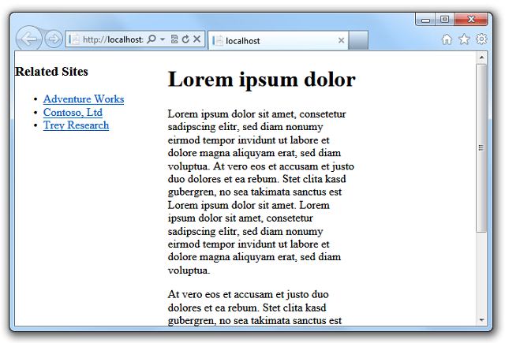](top-features-in-web-pages-2/_static/image41.png)

*Page1.Mobile.cshtml* displayed in an Apple iPhone simulator view in the Firefox browser. Even though the request is to *Page1.cshtml*, the application renders *Page1.Mobile.cshtml*.

[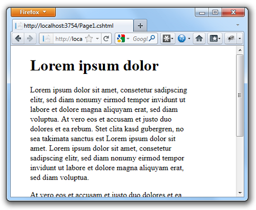](top-features-in-web-pages-2/_static/image43.png)

## Additional Resources

### ASP.NET Web Pages 1 Resources

> [!NOTE]
> Most Web Pages 1 programming and API resources still apply to Web Pages 2.

- [Introduction to ASP.NET Web Pages Programming](https://go.microsoft.com/fwlink/?LinkId=202890)

### WebMatrix Resources

- [WebMatrix 2 What's New](http://webmatrix.com/next)
- [Microsoft WebMatrix Site](https://go.microsoft.com/fwlink/?LinkID=195076)
- [Starting Web Development with Microsoft WebMatrix](https://msdn.microsoft.com/library/hh145669(v=VS.99).aspx)(includes a full-length sample Web Pages application)
